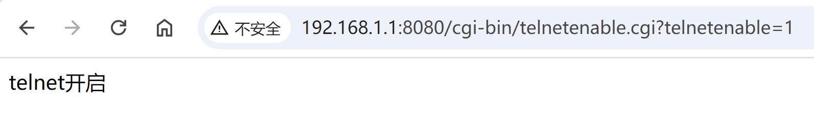
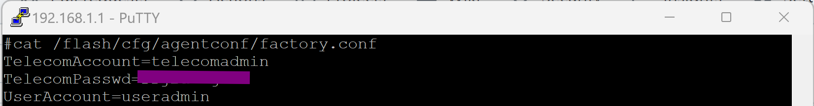

# fuck-telecom

## 获取超级管理员权限
浏览器输入：http://192.168.1.1:8080/cgi-bin/telnetenable.cgi?telnetenable=1 开启 telnet 功能


PuTTY telnet 登录
- 端口：23
- IP: 192.168.1.1
- 密码： 默认无线密码+useradmin默认密码，不要带+

```
cat /flash/cfg/agentconf/factory.conf
```

